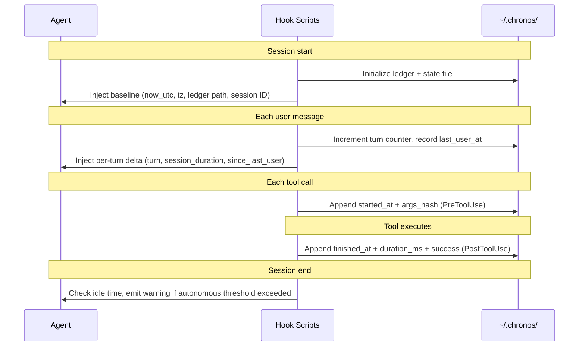

# chronos

[](LICENSE)
[](README.md#platform-matrix)
[](https://arxiv.org/abs/2510.23853)

**Time awareness for AI coding agents.** Stops your agent from guessing "when" and "how long ago".

Works across Claude Code, Codex, OpenCode, Cursor, PI, OpenClaw, Hermes, ADAL.

---

## The problem

LLMs do not know what time it is. They guess. They report "just now" when it was two hours ago. They retry failed commands without checking that the last attempt was 10 seconds ago. They run silently in autonomous loops with no idle detection.

[Arxiv 2510.23853](https://arxiv.org/abs/2510.23853) measured this empirically: even frontier models with timestamps injected into context reach only **65% temporal reasoning alignment** with human judgment. Timestamps appear in fewer than 4% of reasoning traces. The ceiling exists because having access to timestamps is not enough. Agents need explicit rules for *when to look at the clock*.

Chronos is those rules, backed by a queryable tool-use ledger.

---

## What chronos gives you

### 1. Portable decision rules — SKILL.md

Seven triggers that govern when an agent must consult time:

1. Before retrying a failed command: check the ledger for the last attempt and elapsed time
2. Before trusting memory or a cached result: apply staleness thresholds by source type
3. Before reporting progress: use `session_duration` to set summary verbosity
4. Before running a long or destructive command: detect tool degradation from ledger timing
5. Idle-loop detection: pause and surface decisions when the agent runs without user input too long
6. Before any "just now" or "in a minute" statement: replace with a concrete ISO delta from the ledger
7. Date and time questions: consult the baseline first, never guess

### 2. Hook-backed automation (Claude Code, Codex, OpenCode)

Four hook events populate three data sources on every session:



### 3. Honest degraded mode (Cursor, Hermes, ADAL)

Platforms without hook support still get full decision rules. SKILL.md instructs the agent to use `date -u`, `stat`, and `git log` as fallback sources and to state explicitly which source it used.

---

## Platform matrix

| Platform | Support | What you get |
|---|---|---|
| **Claude Code** | Full | All 5 hooks plus SKILL.md |
| **Codex CLI** | Full | All 5 hooks (PreToolUse targets Bash only) plus AGENTS.md |
| **OpenCode** | Partial | TypeScript plugin writes ledger; SKILL reads it |
| **PI (pi-mono)** | Partial | SKILL plus optional extension for ledger |
| **OpenClaw** | Partial | SKILL plus optional plugin-sdk for ledger |
| **Cursor** | Skill-only | Always-on rule with shell-fallback instructions |
| **Hermes** | Skill-only | SKILL injects as user message |
| **ADAL** | Skill-only | SKILL.md only (hook API not public) |

---

## vs. prior art

| | **chronos** | hodgesmr/temporal-awareness | temporal-awareness-mcp |
|---|---|---|---|
| Decision rules | 7 triggers | None | None |
| Tool-use ledger | JSONL, per-call timing | None | None |
| Session baseline | SessionStart hook | Single date injection | API call per request |
| Per-turn elapsed | UserPromptSubmit hook | None | None |
| Idle detection | Stop hook | None | None |
| Degraded mode | Graceful fallback with explicit disclosure | N/A | N/A |
| Platforms | 8 | Claude Code only | Any MCP client |
| Shell | bash plus PowerShell | bash | Node.js |
| Install | `./install.sh` (non-destructive merge) | Manual symlink | MCP client config |

`hodgesmr/temporal-awareness` is the prior Claude Code skill in this space. It shells `date` once at session start. No ledger, no decision rules, no multi-platform.

The MCP servers (`pmbstyle/temporal-awareness-mcp`, `@vreme/temporal-mcp`) provide time data to MCP-compatible clients. They do not ship decision rules and require separate MCP infrastructure.

---

## Install

### Claude Code (full hook stack)

```bash
git clone https://github.com/OthmanAdi/chronos ~/chronos
cd ~/chronos
./installers/claude-code/install.sh         # user scope
./installers/claude-code/install.sh --project  # project scope only
```

Merges hooks into `~/.claude/settings.json` without clobbering existing hooks. Backs up the original.

Verify: start a Claude Code session. You should see `chronos baseline` in context. Run a few tools, then:

```bash
tail ~/.chronos/ledger-*.jsonl
```

### Codex

```bash
./installers/codex/install.sh
```

Installs `~/.codex/hooks.json` and enables `[features] codex_hooks = true` in `~/.codex/config.toml`.

### OpenCode

```bash
mkdir -p ~/.config/opencode/plugins
cp installers/opencode/plugin.ts ~/.config/opencode/plugins/chronos.ts
mkdir -p ~/.config/opencode/skills/chronos
cp SKILL.md ~/.config/opencode/skills/chronos/SKILL.md
```

### Cursor

```bash
mkdir -p ~/.cursor/rules
cp .cursor/rules/chronos.mdc ~/.cursor/rules/
```

### Other platforms

See `installers/<platform>/README.md`.

### Uninstall

```bash
./installers/claude-code/install.sh --uninstall
```

Removes all chronos hooks from settings.json, backs up the original, deletes `~/.claude/skills/chronos/`.

---

## Configuration

Set these environment variables before running Claude Code (or add to shell profile):

| Variable | Default | Effect |
|---|---|---|
| `CHRONOS_HOME` | `~/.chronos` | Ledger and state directory |
| `CHRONOS_IDLE_THRESHOLD_SEC` | `900` | Seconds before idle warning fires in autonomous mode |
| `CHRONOS_LEDGER_RETENTION_DAYS` | `30` | Delete ledgers older than this many days |
| `CHRONOS_LEDGER_GZIP_AFTER_DAYS` | `1` | Compress ledgers older than this many days |

---

## Usage

### Query the ledger directly

```bash
# Last 10 events
tail -n 10 ~/.chronos/ledger-*.jsonl

# Events in the last 10 minutes
./scripts/ledger_read.sh --since 10m

# All Bash calls in the last hour
./scripts/ledger_read.sh --tool Bash --since 1h

# Count by tool type
./scripts/ledger_read.sh --since 1h | jq -s 'group_by(.tool) | map({tool:.[0].tool, count:length})'
```

### Check session state

```bash
cat ~/.chronos/session-$(cat ~/.chronos/current-session).json
# { "started_at_utc": "...", "turn": 12, "session_duration_sec": 847, ... }
```

---

## Ledger schema

JSONL, append-only. Two events per tool call:

```json
{"tool_use_id":"abc","tool":"Bash","args_hash":"f0e1d2c3b4a5","started_at":"2026-04-23T20:00:00Z","started_epoch":1777233600}
{"tool_use_id":"abc","tool":"Bash","args_hash":"f0e1d2c3b4a5","finished_at":"2026-04-23T20:00:12Z","finished_epoch":1777233612,"duration_ms":12000,"success":true}
```

`args_hash` is SHA-256 of the serialized tool arguments, first 12 hex characters. Use it to correlate start and finish events, and to detect repeated identical calls.

---

## Architecture

```
chronos/
  SKILL.md                      portable decision rules (primary)
  AGENTS.md                     mirror for Codex, ADAL, OpenClaw, Hermes, PI
  .cursor/rules/chronos.mdc     Cursor degraded-mode rule
  scripts/
    _lib.sh  _lib.ps1           shared library (time functions, ledger helpers)
    session_start.sh  .ps1      SessionStart hook
    prompt_submit.sh  .ps1      UserPromptSubmit hook
    pre_tool.sh  .ps1           PreToolUse hook
    post_tool.sh  .ps1          PostToolUse hook
    stop.sh  .ps1               Stop hook
    ledger_read.sh  .ps1        ledger query utility
  installers/
    claude-code/                flagship installer
    codex/
    opencode/
    cursor/
    hermes/  pi/  openclaw/  adal/
    detect-shell.sh
```

Runtime state lives at `~/.chronos/`:

- `ledger-<session>.jsonl`: append-only tool-use event log
- `session-<session>.json`: baseline, turn counter, last_user_at timestamp
- `current-session`: session ID fallback for platforms without stdin session_id injection

---

## Design principles

- **Honest degradation.** If a platform cannot do hooks, SKILL.md tells the agent explicitly what fallback to use and requires disclosure.
- **Async where possible.** PreToolUse and PostToolUse run with `async: true`, adding zero latency to tool calls.
- **Portable core.** SKILL.md works on every supported platform. Hook scripts are an optional enhancement layer.
- **Cross-platform parity.** Every bash script has a PowerShell counterpart. No `jq` required on Windows.
- **Self-cleaning.** Ledgers compress after 1 day and delete after 30. No manual maintenance.

---

## Why this was built

No existing tool combined: hook-backed timing, per-turn elapsed counters, a queryable tool-use ledger, and decision rules that change agent behavior, deployed across multiple agent platforms in a single installable skill.

Academic context: [Your LLM Agents are Temporally Blind](https://arxiv.org/abs/2510.23853) (Oct 2025) evaluated LLM temporal reasoning on the TicToc dataset (1,800 multi-turn dialogues, 76 scenario types). The measured gap exists even when frontier models have timestamps available. The fix is not more timestamps. It is explicit rules for *when to consult them*.

---

## Credits

Built by [OthmanAdi](https://github.com/OthmanAdi). MIT licensed.

Prior art and references:

- [hodgesmr/temporal-awareness](https://github.com/hodgesmr/temporal-awareness): prior Claude Code skill, date-shelling only
- [Claude Code hooks](https://code.claude.com/docs/en/hooks): hook event reference
- [Codex CLI hooks](https://developers.openai.com/codex/hooks): Codex hook configuration
- [arxiv 2510.23853](https://arxiv.org/abs/2510.23853): temporal blindness empirical study
- [GitHub issue #24182](https://github.com/anthropics/claude-code/issues/24182): open request for native per-turn timestamps in Claude Code

---

## License

MIT
